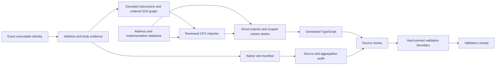

# Native reconstruction tooling

This tooling records what is known about a native executable and its browser reimplementation. It does not construct a playable runtime or weaken the strict native-bank completeness checks.

The tools live outside `src/`: a browser build needs neither Ghidra nor these audit tools. Executable-specific data stays separate from reusable audit and lifting code. No new npm dependencies are required.

## Evidence and implementation are separate

A native function is identified by executable SHA-256, Ghidra language, image base, and an exact entry RVA. Its body ranges and byte hash identify the particular function being reviewed. A symbol name alone is insufficient: names can change, addresses can resolve to enclosing functions, and the same engine version can appear in different executables.

A callback slot also has a title-specific bank and secondary index. Multiple slots may eventually refer to one function or one shared TypeScript implementation. Slot identity, function identity, source presence, reviewed behavior, and startup integration remain separate facts.



An import or a factory declaration is evidence of source structure, not evidence that a callback has been tested or registered at startup. Generated counts must preserve that distinction. Unknown and unsupported states are useful outputs; they must not become implicit success.

## Tools

- [Exact-address Ghidra ledger](ghidra-ledger.md): compare reviewed expectations with direct-address observations and saved database evidence.
- [Native slot manifest](native-slots.md): inventory, ownership, source discovery, and partial aggregation accounting for all 840 Aokana slots.
- [Validation boundaries and snapshots](validation-boundaries.md): hash-pinned reviewed test selection, per-file result receipts, and current checkout handoffs.
- [Native lifting feasibility and prototype](native-lifting.md): a Ghidra frontend with a project-local intermediate representation, explicit address routing, and a bounded TypeScript backend.
- [Bridge-to-TypeScript user guide](native-lifting-guide.md): live export, mapping, lifter authoring, import, emission, and focused verification.
- [Dedicated Ghidra bridge](ghidra-bridge.md) and [small MCP](native-mcp.md): health and exact function exports to files, with separate raw/high representations and compact receipts.
- [Implementation mapping database](native-mappings.md): source-pinned direct imports, explicit signatures/ABI bindings, rich types and same-address variant identities.
- [Decoded graph importer](ghidra-cfg-import.md) and [CFG backend](native-cfg.md): branches, loops, phi nodes, database-defined calls and scoped code/type variant stacks. [Run the synthetic export-to-TypeScript example](../../tools/native-lift/examples/ghidra/README.md).
- [Generational address slots](generational-address-slots.md): variable storage,
  canonical address aliases, derived parent generations, typed fields/arrays,
  implementation-owned globals, safe merges, and exact whole-function routes.

Commands and limitations belong in each tool's document. Do not substitute `npm test` for a reviewed, explicitly selected validation boundary during Aokana reconstruction.

## September 19 validation

The initial tooling slice passed **41/41 tests across five explicitly reviewed files**. Its [manifest](boundaries/tooling-2026-09-19-final.manifest.json) and [receipt](boundaries/tooling-2026-09-19-final.receipt.json) are historical after the architecture work below. The [slot audit](boundaries/aokana-slots-2026-09-19.audit.json) records declaration and integration gaps separately.

The architecture slice adds a dedicated Java export bridge, a two-tool Node MCP,
an explicit implementation database and a CFG importer/backend. Its
[reviewed manifest](boundaries/tooling-2026-09-19-architecture.manifest.json) and
[receipt](boundaries/tooling-2026-09-19-architecture.receipt.json) record
**80/80 tests passed across ten focused files** before the file-export changes.
They are historical after those changes. This selection also checked the original
audit tools. `.mts` and `.cts` sources are included in boundary hashes.

Actual Ghidra 12.1.3 decoding/decompilation of invented add/branch/loop functions
validated the Java exporter and the graph importer. Those instructions were never
executed. Generated TypeScript passed strict checking, including a direct import
of the existing scalar `nativeVectorAngle` implementation.
Installation/CodeBrowser activation were completed after this historical
architecture receipt. The Aokana
ledger still lacks independent persisted readback, and its mapping seed retains
unresolved native ABI evidence explicitly.

The [original bridge build receipt](boundaries/ghidra-bridge-2026-09-19.build.json)
preserves the version 0.1.0 ZIP hash and exporter sources.

The file-export update makes MCP and CLI exports use `/v1/function/file`.
Ghidra writes the artifact directly; stdout contains only its receipt. The
[focused manifest](boundaries/tooling-2026-09-19-file-export.manifest.json) and
[receipt](boundaries/tooling-2026-09-19-file-export.receipt.json) cover the current
sources with **24/24 tests across three files**: MCP transport/file receipts,
offline bridge graphs and the downstream importer. The separate four-test Java
integration also passed, including five real file exports of invented functions
and exclusive-publication checks.

Version 0.2.0 is built under `tools/ghidra-bridge/out/reviewed-release-0.2.0/`;
the [new build receipt](boundaries/ghidra-bridge-2026-09-19-file-export.build.json)
pins its sources and ZIP. The installed plugin subsequently passed a live health
check and wrote the first Aokana capture directly to local evidence storage.

The first live lifting route is Aokana `0x140095bb0`. An exact owner-load rule
maps its `RCX + 0x26` 16-bit read to a direct import of the existing particle
frame implementation through a project-local adapter. The generated TypeScript
passed strict checking and a structural scalar check. See the
[user guide](native-lifting-guide.md) and
[`095bb0` metadata record](evidence/aokana-095bb0.md).

The [live-lifting manifest](boundaries/tooling-2026-09-19-live-lifting.manifest.json)
and [receipt](boundaries/tooling-2026-09-19-live-lifting.receipt.json) record
**27/27 focused tests passed** across the importer, CFG backend, and mapping
database. This is the current validation boundary for native-lift sources; the
file-export receipt remains historical evidence for the unchanged bridge/MCP path.

The next tooling slice analyzes Aokana `0x140095be0` as a variable-bearing
eight-block function. It retains the native CFG in a generational slot artifact,
then routes the exact reviewed body to a direct import of the existing particle
update implementation. The
[generational-lifting manifest](boundaries/tooling-2026-09-19-generational-lifting.manifest.json)
and [receipt](boundaries/tooling-2026-09-19-generational-lifting.receipt.json)
record **33/33 focused tests passed** across the slot/route, importer, CFG, and
mapping files. It is historical after the typed-slot extension.

The typed-slot slice adds database-authored native record layouts and global
roots, exact parent-generation derivations for address arithmetic, constant and
dynamic `PTRADD` element projections, and database-bound reviewed routes. Its
[manifest](boundaries/tooling-2026-09-19-typed-slots-v2.manifest.json) and
[receipt](boundaries/tooling-2026-09-19-typed-slots-v2.receipt.json) record **36/36
focused tests passed** across the same four files. This is the current
native-lift validation boundary.

Recheck the current boundary without running tests:

```sh
node tools/native-audit/boundary.mjs check docs/tooling/boundaries/tooling-2026-09-19-typed-slots-v2.manifest.json
```

Use the same manifest with `run` and a new receipt path to repeat exactly that selection. A source change requires renewed review and a new manifest.

## Architectural boundaries

Use Ghidra as the native decoding and analysis frontend. Keep the export schema and TypeScript backend project-local so that the frontend can later be replaced without changing game runtime code. Raw instruction P-code and decompiler HighFunction P-code are different representations and need distinct schemas.

An emitted implementation must carry its source provenance and a list of assumptions. Hand-written replacements and pattern rules need explicit input/output contracts and exact applicability criteria. An unrecognized operation, ambiguous call target, or unproven arithmetic profile should stop lowering with a useful diagnostic.

Cross-version matching proposes candidates. It does not carry acceptance automatically into another binary. Review a candidate's entry/body, data dependencies, calling convention, and arithmetic profile before assigning it to a shared implementation. This also prevents a matching wrapper from hiding a changed lower-level function or table.

The current project uses title-local owners for display pools, surfaces, coefficient tables, text state, mounted metadata, and worker state. Future contract checks should record which concrete object owns each resource and assert identity at the composition boundary. Static source references alone cannot prove runtime identity.

## Work after the initial tools

The September 19 handoff also requests shared-owner identity checks, a reusable arithmetic reference library, and wrapper-contract checks. Those remain future work. The tools above establish the initial evidence, inventory, validation, and handoff workflow; they do not complete the entire wishlist.

The slot schema currently records observations and deliberately refuses unverified acceptance labels. Importing verified ledger and test receipts to advance those states is a separate next step. The versioned exporter/importer now works for the reviewed scalar CFG subset. Memory models, floating arithmetic, broader native ABI recovery and automatic patch-pattern recognition still require explicit lowering rules and evidence.

Variant definitions remain arrays, while calls use active stack frames. Nested
code/type overrides restore earlier frames on exit and preserve debug traces.
Ordinary calls to registered unstable slots automatically honor the stack. Known
alternate bodies must already be decoded and have distinct reviewed body identity;
the tools do not infer new instructions from patch bytes.

The restricted SSE2 power kernel remains game implementation work. The lifting prototype must not be represented as solving its floating-point equivalence gate. The future arithmetic reference library needs independently specified rounding and conversion behavior before that kernel can use it as evidence.

The original investigation notes are ignored by Git. New tool documentation and reusable metadata are placed under `docs/tooling` and `tools/` so an ordinary checkout retains them. Historical acceptance claims should be imported as historical records, never backfilled with invented hashes or test receipts.
